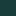

# Overview

The document that carries one of every link form the gate resolves.

- Down: [the section landing page](dir/README.md).
- Up: [the boot profile](../boot-profile.md).
- Root-absolute: [the decision](/decisions/0001-adopt-leji.md).
- A directory, resolvable because it holds a README: [the section](dir/).
- Fragment-only: [this heading](#overview).
- A URL: [the specification](https://leji.org/spec/).
- An address: [the owner](mailto:owner@example.invalid).
- Percent-encoded: [a name carrying a space](dir/with%20space.md).
- Nested parentheses: [a](dir/(x).md).
- Angle-bracketed: [b](<dir/with space.md>).
- The escaped spelling the viewer emits: [c](dir/\(x\).md).
- An image: .
- A reference: [the CRLF document][ref].

A broken-looking link inside a code span is code: `[gone](nowhere.md)`.

A broken-looking link inside a fenced block is code too:

```text
[gone](nowhere.md)
```

[ref]: crlf.md "The CRLF document"
