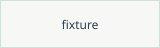

<!--
   Feature family: CommonMark core — headings in both forms, paragraphs, the
   inline set, blockquotes, thematic breaks, and both hard-break spellings.
   Every construct here is inside the supported rendering subset, so this file
   contributes no lint finding. The subset itself is stated in
   adoption/rendering.md.
-->

# ATX heading, level one

## ATX heading, level two

### ATX heading, level three

Setext heading, level one
=========================

Setext heading, level two
-------------------------

A paragraph of plain prose. Blank lines separate paragraphs, and a single
newline inside a paragraph is a soft break that renders as a space.

Inline constructs, one paragraph: *emphasis*, _emphasis again_, **strong**,
__strong again__, `inline code`, a [link to another page](../domain/overview.md),
a [link with a title](../domain/overview.md 'Fixture domain document'), and an
image: 

A code span opens with two backticks when its own content carries one:
``a `nested` backtick`` stays one span.

A reference link resolves through its definition: [the boot profile][boot].

[boot]: ../boot-profile.md

> A blockquote carrying one sentence.
>
> A second paragraph inside the same blockquote, with `inline code` in it.

> A blockquote can nest.
>
> > The inner quote is one level deeper.

A hard break spelled with two trailing spaces closes this line  
and this line continues the same paragraph.

A hard break spelled with a trailing backslash closes this line\
and this line ends the paragraph.

---

Text after a thematic break. The three spellings of a break (`---`, `***`,
`___`) are one construct, and each one appears here.

***

Text after the second break.

___

Text after the third break, the underscore spelling.
