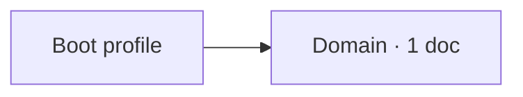

<!--
   Leji-specific semantics, two of them:

   1. YAML frontmatter is metadata. It is never rendered, so the block above
      reaches the reader as nothing at all.
   2. HTML comments are legal and invisible. They carry Leji's own markers, so a
      renderer that dropped or displayed them would break a generated page.

   Both are inside the supported rendering subset. Comments are the one HTML form
   the rendering lint excepts, which is why this file reports no finding.
-->

# Frontmatter and comments

The frontmatter block at the top of this file is metadata for tooling. A
conforming renderer shows the heading above as the first visible thing on the
page.

<!-- leji:generated-map:start -->

<!-- leji:generated-map:end -->

The two comments around that fence are the marker shape a generated map uses:
the tool rewrites what sits between them and leaves the prose alone. A renderer
that showed the marker text would put tooling detail in a reader's face, and one
that dropped the comments from the served bytes would break the next
regeneration.

<!-- A comment may also sit inline in the prose. --> This sentence follows one on
the same line.

<!--
   A multi-line comment closes the file. Nothing between the delimiters is
   rendered, including text that looks like markup, so a marker may carry
   anything a tool needs.
-->
