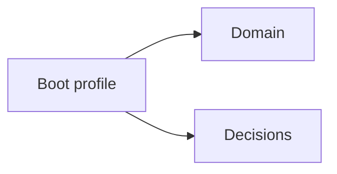
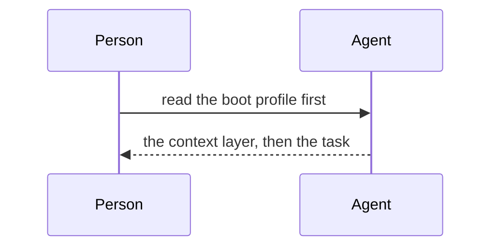

<!--
   Leji-specific semantics: a ```mermaid fence renders as a diagram where the
   renderer supports mermaid and as a code block where it does not. Both are
   conforming, which is why the fence is in the subset and never a lint finding.
   The same fence shape is what the generated layer map on the overview page
   carries.
-->

# Mermaid

A flowchart, the shape the generated layer map uses:



A sequence diagram, to keep the fixture from pinning one diagram type:



A fence whose mermaid body is not valid mermaid still stays inside the subset:
the renderer's error state is its own concern, not a rendering-subset question.

```mermaid
this is not a diagram
```
