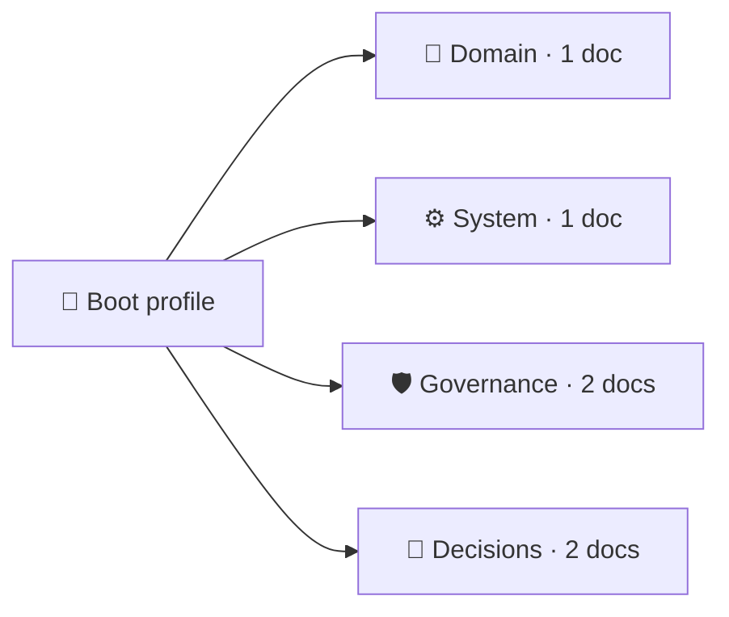

# acme-billing-context

This is the **Leji context layer** for `acme-billing-context`: the shared, validated context
people and coding agents read before working in this repository. Start with the boot
profile, then browse the categories in the sidebar.

This page is yours to edit. The map below is rendered between the markers by the viewer
and by `leji export`; this file is never rewritten.

<!-- leji:generated-map:start -->

<!-- leji:generated-map:end -->

- Write a ```mermaid code block in any document and it renders as a diagram here.
- Run `leji conformance` to see the level this layer claims and verifies.
